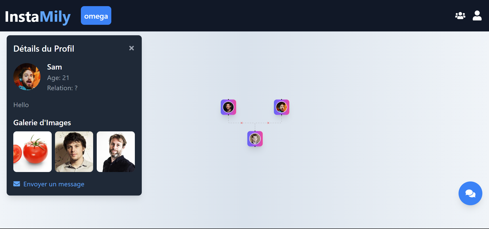

# InstaMily

 <!-- Add the path to the image cover here -->

## Overview

**InstaMily** is an interactive platform designed to bring families together by creating and exploring family trees. Users can join existing family trees, communicate through private family chat rooms, and preserve their family history in a modern, connected way.

## Features

- Create and explore detailed family trees
- Private family chat rooms
- Easy-to-use interface
- Connect with long-lost relatives

## Project Objectives

- Master both front-end and back-end web development technologies
- Integrate third-party services like Firebase for authentication and databases
- Enhance project management skills with Trello
- Develop a modern and responsive UI for seamless user experience

## Technologies Used

### Front-End

- HTML
- CSS
- JavaScript
- TypeScript
- React.js

### Back-End

- Node.js
- Express.js

### Database

- MongoDB

### Version Control

- Git
- GitHub

## Challenges

- **MongoDB Integration:** Setting up authentication and database synchronization
- **Time Management:** Completing the project within a 27-day timeframe
- **UI Optimization:** Maintaining performance while achieving an attractive design
- **Testing and Debugging:** Ensuring a bug-free experience

## Timeline

**Week 1:**

- Research and project planning
- Designing mockups and wireframes (Figma)

**Week 2:**

- Developing the user interface (HTML, CSS, React.js)
- Setting up MongoDB and Express for authentication and database

**Week 3:**

- Back-end integration (Node.js, Express.js)
- Testing and debugging core functionalities

**Week 4:**

- Finalizing design and features
- Final testing, bug fixing, and preparing for presentation

## Conclusion

InstaMily is an innovative solution that helps families stay connected and preserve their legacy in a digital, interactive format.

---

**Team Members:**

- [GitHub Profile](https://github.com/lepronet85)
- [LinkedIn](https://www.linkedin.com/in/abdoul-aziz-soumanou-salifou-34bb82190/)
